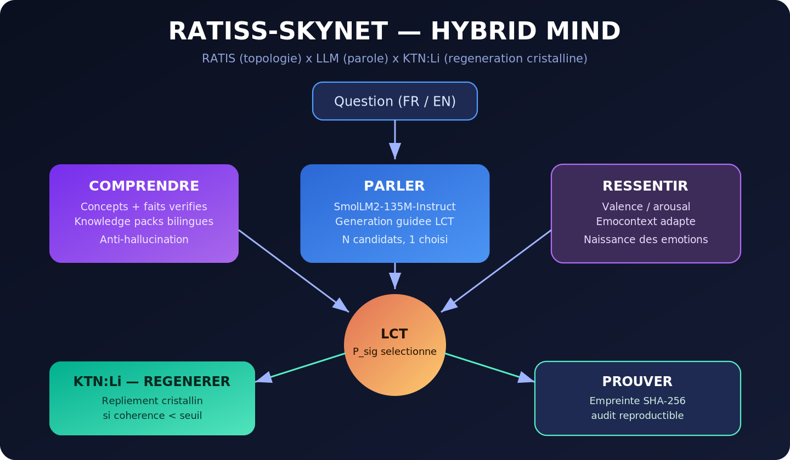

<p align="center">
  
</p>

[](https://github.com/jonathansearch)

# RATIS — Topological Understanding Model (TUM)

**RATIS is a TUM: the evolution of the language model toward a structural-understanding architecture.**

> A classic language model predicts the most probable word. RATIS keeps that generation capability and adds the organ it lacks: the **measurement of its own structural coherence**. Where a conventional model hallucinates, RATIS detects the inconsistency and folds back. Where it guesses, RATIS proves.

[](ratiss_skynet/docs/MCT.md)
[](#)
[](ratiss_skynet/skynet/identity.py)
[](ratiss_skynet/artifacts/RAPPORT_AGI.md)
[](#)
[](#)
[](https://orcid.org/0009-0000-4092-5313)

Project led by **Jonathan Evina** (RATIS Labs, Cameroon).
Intellectual property: **JOHNKING0 & Jonathan Evina**.

**Guiding principles**: permanent iteration — transdisciplinarity — demonstration by operation.

---



---

## Architecture: HYBRID MIND

A unified architecture, implemented in [`ratiss_skynet/skynet/hybrid_mind.py`](ratiss_skynet/skynet/hybrid_mind.py). Six integrated capabilities, ordered along the processing pipeline:

| # | Capability | Function | Principle |
|---|---|---|---|
| 0 | **FEEL** | Simulated thermodynamic body | The emotional state modulates the generation parameters |
| 1 | **UNDERSTAND** | Extraction of bilingual concepts and verified facts | Anti-hallucination grounding |
| 2 | **SPEAK** | Generation guided by topological coherence | RATISS One engine + LCT selection |
| 3 | **REGENERATE** | Crystalline folding upon pattern rupture | KTN:Li, threshold modulated by tension |
| 4 | **CLOSED LOOP** | Topological confidence score (0–100 %) | Real-time auditability |
| 5 | **PROVE** | SHA-256 fingerprint of the active subgraph | Reproducibility and traceability |

### Research modules

| Module | Function | Status |
|---|---|---|
| `rlm_layer.py` | Recursive decomposition and crystalline folding at the weakest link | Validated |
| `quantum_select.py` | Amplitude amplification toward the coherent candidates | Validated (1/8 → p = 0.76) |
| `arc_induction.py` | Induction of unknown rules from three examples | Demonstrated |
| `memory.py` | Episodic, semantic and procedural memory on a SHA-256 chain | Demonstrated |
| `planner.py` | Planning by persistence path (TPP/MSTM/RTD/PNE) | Demonstrated |

**Evaluation against the ten conditions of artificial general intelligence**: nine conditions demonstrated, one voluntarily deferred (multimodal perception). Detailed analysis in [`artifacts/RAPPORT_AGI.md`](ratiss_skynet/artifacts/RAPPORT_AGI.md).

**Core principle: LCT-guided generation.** The engine proposes several candidates; the topology — the **P_sig** persistence signature of the correlation graph — selects the most coherent one. The law is invariant: `R = P_sig`, `ΔW = η·φ·P_sig·C`.

---

## Demonstration by operation

| Query | Unguided generation | Guided generation (HYBRID MIND) | Result |
|---|---|---|---|
| *What is a black hole?* (EN) | coherence 65 | **coherence 97.5** | improvement |
| *Qu'est-ce qu'un trou noir ?* (FR) | repetition loop | **coherence 36 → 117, loop interrupted** | improvement |
| *Raconte une histoire de dragon.* (FR) | repetition loop | **uniqueness 0.42 → 0.85, loop interrupted** | improvement |

In all three cases, the topological selection **interrupts the engine's repetition loops** and **increases coherence**. The fusion does not confer new knowledge to the model; it **stabilizes and selects** its output.

---

## Repository structure

```
ratiss-Skynet/
├── models/                         # RATISS One generation engine (Git LFS)
└── ratiss_skynet/                  # source code and evidence
    ├── skynet/
    │   ├── hybrid_mind.py          # unified architecture (full pipeline)
    │   ├── identity.py             # RATIS identity sealed SHA-256
    │   ├── confidence.py           # closed loop (confidence 0–100 %)
    │   ├── thermo_emotions.py      # thermodynamic emotions
    │   ├── memory.py               # tamper-proof chained memory
    │   ├── reasoning.py            # contradiction detection, honesty
    │   ├── safety.py               # guardrail, audit log
    │   ├── planner.py              # topological planner
    │   ├── arc_induction.py        # few-shot rule induction
    │   ├── rlm_layer.py            # recursive decomposition × KTN:Li
    │   └── quantum_select.py       # amplified selection (research)
    ├── training/                   # frozen training protocol (LCT)
    ├── docs/                       # full documentation
    ├── scripts/                    # diagnostics, demonstrations, tests
    └── artifacts/                  # JSON reports and SHA-256 proofs
```

**Full documentation: [`ratiss_skynet/docs/README.md`](ratiss_skynet/docs/README.md)**

## Installation and execution

```bash
git clone https://github.com/samajonathan9-source/ratiss-Skynet.git
cd ratiss-Skynet && git lfs pull
pip install torch --index-url https://download.pytorch.org/whl/cpu
pip install transformers peft scipy numpy
cd ratiss_skynet && python scripts/test_transform_fast.py
```

---

*© 2026 JOHNKING0 & Jonathan Evina.* The LCT law is invariant. The rest remains open to iteration.
